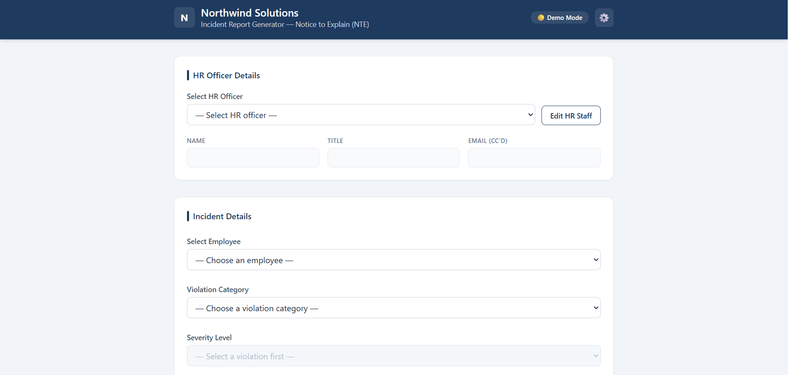
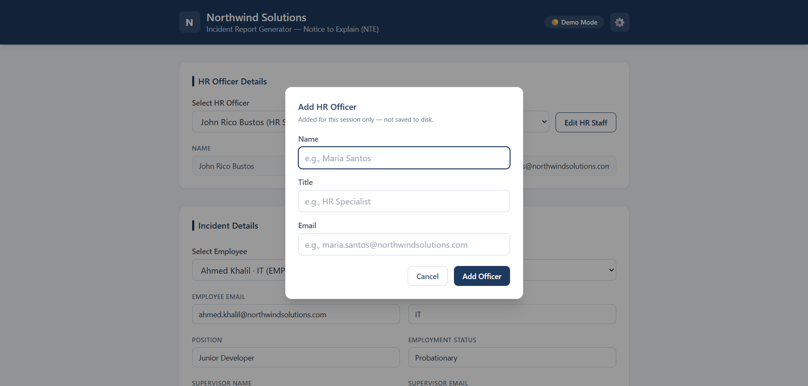
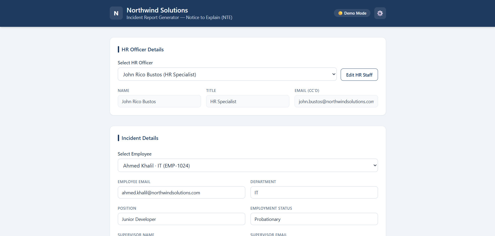
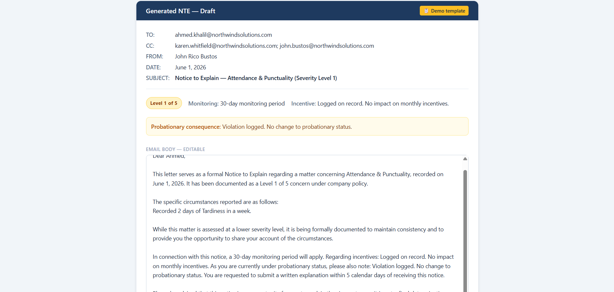
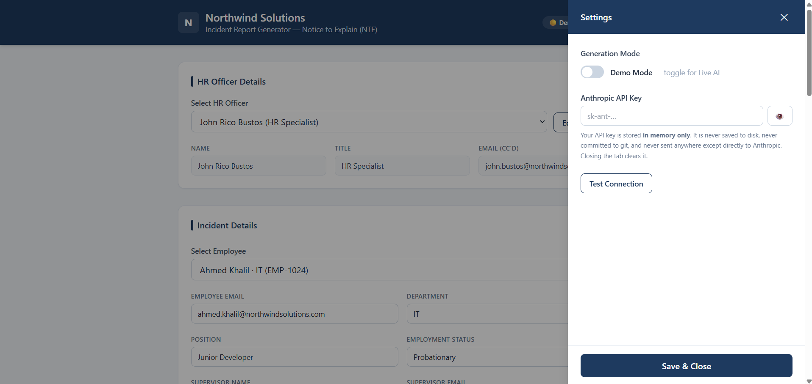

# Northwind Incident Report Generator

> Pick an employee, pick a violation, pick a severity — get a professional, ready-to-send HR Notice to Explain (NTE) email in seconds.


-success)

A lightweight, single-page web tool that helps HR personnel draft consistent, well-worded incident report emails. Fill in a short form, and the app produces a polished NTE draft you can edit, copy, download, or print. It works fully offline as a demo, and can optionally call Claude for real AI-drafted emails when you supply your own API key.

> ⚠️ **Northwind Solutions is a fictional company.** Every employee name, ID, email, supervisor, and department in this project is made up for demonstration purposes. No real personal or company data is used or exposed.

---

## 🔗 Live Demo

**Coming soon** — a hosted GitHub Pages deployment is planned. For now, clone the repo and open `index.html` (see [Setup](#-setup--run-locally)).

---

## 📸 Screenshots

A quick visual tour of the app. The empty form on first load, ready for input:



See below for the filled form, the generated email, settings, and the in-session HR officer modal.

---

## ✨ Features

- ✅ **Searchable employee directory** — selecting an employee auto-fills their department, position, status, and supervisor (all editable for corrections)
- ✅ **Smart severity filtering** — each violation category only offers the severity levels that actually apply to it (e.g., Harassment is 3–6, Fraud is 4–6)
- ✅ **Color-coded severity bands** — amber (L1–2), orange (L3–4), red (L5–6), shown consistently on the form and in the email
- ✅ **Automatic consequences** — monitoring period and incentive impact populate from the chosen severity
- ✅ **Probationary detection** — probationary employees get the extra probationary-consequence clause automatically
- ✅ **HR officer selector** — choose who issues the notice; name, title, and CC'd email fill in automatically, and you can add officers on the fly
- ✅ **Two generation modes** — built-in Demo templates (no key needed) or real **Live AI** drafting via Claude
- ✅ **Graceful fallback** — if a live API call fails, the app falls back to a demo template with a clear notice, so you're never left with a broken screen
- ✅ **Editable output** — tweak the draft inline before sending
- ✅ **Copy / Download / Print** — clean plain-text output that pastes neatly into Outlook or Gmail
- ✅ **Privacy-first key handling** — your API key lives in memory only, never on disk or in git



---

## 🛠 Tech Stack

- **HTML5 + vanilla JavaScript** — no framework; the whole app is a handful of plain scripts
- **Tailwind CSS** (via CDN) for styling, with a small `style.css` for the brand theme, severity badges, animations, and print rules
- **Claude API** (Anthropic) — optional, for Live AI mode (uses the latest Claude Sonnet model)
- **No build step, no dependencies, no server** — it runs from the local file system

---

## 💡 How It Works

The app loads a fictional employee directory and a violation catalog from embedded data, so it runs entirely in the browser with no backend. You pick the HR officer issuing the notice, choose an employee, select a violation category and a valid severity level, and describe the incident. The app assembles all of that — employee and supervisor details, severity guidelines, monitoring period, incentive impact, and response deadline — into a structured context. In **Demo Mode**, it fills a professionally worded template matched to the severity band; in **Live AI Mode**, it sends that context to Claude and returns a freshly drafted email. Either way you get the same clean email panel, which you can edit, copy, download, or print.



---

## 🚀 Setup & Run Locally

No build tools, package installs, or server required.

```bash
git clone https://github.com/johnricobustos/incident-report-generator.git
cd incident-report-generator
```

Then simply **open `index.html` in your browser** — double-click it, or drag it into a browser window. That's it.

> The data is embedded directly in `data.js` precisely so the app works from `file://` with no local web server. (Browsers block loading local JSON files over `file://`, which would otherwise break a `fetch`-based approach.)

---

## 🤖 Demo Mode vs. Live AI Mode

The app runs in **Demo Mode** by default — no setup, no API key, no cost.

| | Demo Mode | Live AI Mode |
|---|---|---|
| **Setup** | None | Your own Anthropic API key |
| **How it drafts** | Pre-written templates, matched to severity band | Real-time generation by Claude |
| **Cost** | Free | Billed to your Anthropic account |
| **Best for** | Trying the app, offline use, demos | Production-quality, context-aware drafts |



### Switching to Live AI Mode

1. Click the **⚙️ gear icon** in the header to open Settings.
2. Toggle **Demo Mode → Live AI Mode**.
3. Paste your Anthropic API key. Get one from the [Anthropic Console](https://console.anthropic.com/).
4. (Optional) Click **Test Connection** to verify the key works.
5. Click **Save & Close**. The header status updates to 🟢 **Live AI**.

> 🔒 **Your API key is stored in memory only.** It is never written to disk, never committed to git, and never sent anywhere except directly to Anthropic. Closing the tab clears it. You'll re-enter it next session.



---

## 📂 Project Structure

```
incident-report-generator/
├── index.html          # App shell — all UI (form, email panel, settings, modals)
├── style.css           # Brand theme, severity badges, animations, print styles
├── data.js             # Embedded data, so the app runs from file:// with no server
├── api.js              # Claude API integration (Live AI mode)
├── app.js              # Form logic, validation, email assembly, settings, actions
├── data/               # Canonical JSON source files (mirrored into data.js)
│   ├── employees.json  # Fictional employee directory
│   ├── violations.json # Violation catalog + severity guidelines & consequences
│   ├── hr_staff.json   # HR officer roster
│   └── positions.json  # Common job titles (for a future Add/Edit Employee UI)
├── screenshots/        # Images used in this README
├── BLUEPRINT.md        # The original project spec — the source of truth for the build
├── README.md           # You are here
└── LICENSE             # MIT
```

---

## 🧠 Built with Claude Code

This project was built collaboratively with [Claude Code](https://claude.com/claude-code), Anthropic's agentic coding tool. I want to be upfront about that: Claude wrote much of the code under my direction. I designed and owned the product — the concept, the HR domain model, the severity and consequence logic, the UX flow, the privacy decisions around API-key handling, and the incremental, chunk-by-chunk build plan — and I reviewed, tested, and approved every change in the browser before it was committed. The spec in [`BLUEPRINT.md`](BLUEPRINT.md) is the document I authored to drive that process.

In short: the vision and the decisions are mine; Claude was a fast, capable pair-programmer that helped me execute them.

---

## 📄 License

Released under the **MIT License** — free to use, modify, and distribute. See the [`LICENSE`](LICENSE) file for the full text.

---

## 👤 Author

**John Rico Bustos**
GitHub: [@johnricobustos](https://github.com/johnricobustos)

Reach out via GitHub or open an issue in this repo.
